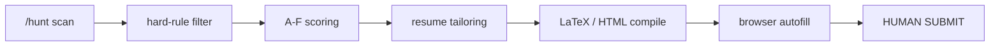

# AI Job Hunt Pipeline

Claude Code workflow that turns a job posting into a submission-ready application:
scan boards, score the JD against a weighted rubric, tailor a one-page resume,
compile the PDF, and fill the web form -- then stop, so a human always hits Submit.



The command files are written in Chinese on purpose: this pipeline targets Chinese job
portals (Nowcoder, Zhilian, Boss, and the campus sites of Tencent, ByteDance, Alibaba,
Meituan, JD). The workflow logic below is language-agnostic and documented in English here.

Applying in North America instead? Use the leaner sibling,
[ai-job-hunt-pipeline-na](https://github.com/haiiibin/ai-job-hunt-pipeline-na):
same scoring rubric and LaTeX pipeline, English workflow spec, no portal autofill.

## Why this exists

Applying at scale is a volume game, but most of that volume is repetitive form-filling that
does not deserve a single token of model attention. This pipeline spends the LLM effort where
judgment actually matters -- scoring each JD and tailoring the resume to it -- and automates
the mechanical rest, right up to (but never including) the Submit click. It was built and used
daily during a real 2026 campus-recruiting campaign.

## Repository layout

```
CLAUDE.md                    Workflow spec (the master document, Chinese)
compile_cv.py                CV/CL compiler (LaTeX + HTML inputs)
.claude/commands/hunt.md     /hunt -- job radar command
.claude/commands/apply.md    /apply -- end-to-end web-application command
docs/scoring-rubric.md       A-F scoring rubric + anti-guessing discipline
docs/cn-workflow.md          Chinese-resume workflow (locked format + full-page check)
docs/webapp-autofill.md      Browser form-filling playbook (per-portal gotchas)
templates/cv_template.tex    English CV template (pdflatex)
templates/cl_template.tex    English cover-letter template (xelatex)
templates/cn_skeleton.html   Chinese-resume skeleton (CSS locked)
pipeline/filter_rules.yaml   Hard-rule pre-filter wordbook (used by /hunt)
.gitignore                   Excludes all personal data and build artifacts
```

Everything that carries personal data is user-created and gitignored, and never ships with the
repo: `resume-data/`, `pipeline/jobs.yaml`, `pipeline/profile.yaml`, `pipeline/watchlist.md`,
`output/`, `photo.jpg`, `.playwright-profile/`, `.playwright-mcp/`, and `.mcp.json`.

## Pipeline stages

### 1. Discover -- `.claude/commands/hunt.md`

`/hunt` sweeps four channels: company career sites (a user-defined watchlist), aggregators
such as Nowcoder as a discovery layer, social-recruiting boards (Zhilian and 51job), and Boss
Zhipin in strictly read-only mode. It dedupes against `pipeline/jobs.yaml`, runs the hard-rule
pre-filter, gives each survivor an F pre-score, and emits a two-tier report (tier 1 = confirmed
eligible, tier 2 = worth a look). The command stops at the report; the user picks which jobs go
to `/apply`.

### 2. Score -- `docs/scoring-rubric.md`

Every JD is scored on five weighted dimensions (A through E) that combine into a single F score.
`/hunt` uses it for a quick ranking pass; `/apply` uses it for the formal scoring pass against
the full JD text plus three job-authenticity checks.

### 3. Tailor -- `CLAUDE.md` + `docs/cn-workflow.md`

Resume content is pulled dynamically from `resume-data/` by matching JD tags against each
experience and project file. No fixed per-role resumes are maintained. English roles build from
`templates/cv_template.tex` and `templates/cl_template.tex`; Chinese roles fill
`templates/cn_skeleton.html`, whose CSS is locked so formatting never drifts between jobs.

### 4. Compile -- `compile_cv.py`

One entry point routes by file type: `CL_` and `CV_CN` files go to xelatex, other `.tex` files
to pdflatex, and `.html` files render through headless Chrome. It verifies the PDF is non-empty
and that the LaTeX log ends with `(1 page)`. The Chinese path additionally measures page fill
with PyMuPDF and requires a single full page.

### 5. Autofill -- `.claude/commands/apply.md` + `docs/webapp-autofill.md`

`/apply` drives a real Chrome through the Playwright MCP: it opens the JD, pauses for the user
to log in by hand, fills the form from the freshly tailored resume, uploads the PDF, screenshots
the completed form, and stops. Each supported portal (ByteDance, Tencent, Zhilian, and more) has
its own documented control quirks so autofill survives Element-UI and Formily edge cases.

## Design decisions

- **Hard-rule pre-filter before any LLM scoring (zero-cost rejection).** `pipeline/filter_rules.yaml`
  applies three layers in priority order -- safe_phrases (a whitelist so "非外包 / not outsourced"
  never trips the "外包 / outsourced" veto) beats hard_veto (never enter the pipeline) beats flag
  (force to tier 2 with the matched term shown). Junk postings are dropped before a model reads them.

- **Anti-guessing scoring discipline.** The E red-flag dimension only deducts on red lines that
  appear verbatim in the JD (outsourcing, single-day weekends, contradictory duties). Deducting on
  hunches like "probably stressful" or "likely overtime" is forbidden; missing information is scored
  neutral, and any stated salary or city must be scored on the stated data, not written off as
  "undisclosed".

- **Ghost-job signals.** Postings older than 30 days with no update, no application entry, inactive
  HR-activity text, or a stale in-library status feed the E dimension and get a ghost-suspect flag in
  the report. They are surfaced, not silently auto-rejected.

- **Human-submit iron rule.** The pipeline never auto-submits any form, never clicks the portal's
  "parse and overwrite" prompt (which would clobber the fields it just filled), and never handles the
  login itself. The user logs in and hits Submit, every time.

## Setup

1. Install [Claude Code](https://docs.anthropic.com/en/docs/claude-code) and open this repo in it.
2. Provide a LaTeX distribution for English CV/CL compilation: `compile_cv.py` first looks for a
   portable `miktex_install/` tree in the repo root, then falls back to a MiKTeX or TeX Live
   install on your PATH. The Chinese-resume path needs only Chrome or Edge, no LaTeX.
3. Optional, for the `/apply` autofill stage: install Node.js and register `@playwright/mcp` in a
   repo-root `.mcp.json` (user-created, gitignored) so the `browser_*` tools become available.

## Bring your own data

No sample personal data ships with this repo. Create the following files (all gitignored). The
values below are fictional and only show the shape.

`resume-data/` holds every resume fragment; content is selected per JD, never hand-maintained as
separate fixed resumes:

```
resume-data/
  _index.yaml          index entry, always read first (lightweight)
  skills.md            skills list (bilingual sections optional)
  education.md         education background
  experience/*.md      one file per role: core bullets + *_focus variants, EN and ZH sections
  projects/*.md        one file per project
```

`resume-data/_index.yaml` -- the tag index the tailoring step reads first:

```yaml
experiences:
  - file: experience/company-a.md
    tags: [structural, site-supervision, autocad]   # matched against the JD
    priority: required               # required = every resume / optional = conditional
    condition: ""                    # selection rule when optional (e.g. "finance roles only")
    date_range: "2024-12 ~ present"
projects:
  - file: projects/project-x.md
    tags: [bridge-design, cost-estimation]
    date_range: "2024-03"
```

`pipeline/profile.yaml` -- fixed personal fields reused across web-application forms:

```yaml
name: Test Applicant
phone: "(+86) 100 0000 0000"
email: test.applicant@example.com
wechat: test_wechat_id
id_type: 居民身份证              # or 护照 / 港澳台居民居住证
id_number: "<your national ID number>"
gender: 女
preferred_cities: [北京, 上海]   # matched against the 目标城市 config in hunt.md
channel_source: 官网             # default answer to "了解渠道 / how did you hear about us"
social:
  linkedin: testapplicant
  github: testapplicant
education:
  - school: Example University
    degree: 硕士                 # degree level
    major: Structural Engineering
    start: "2022-09"
    end: "2023-12"
    gpa: "0.0/4.0"
  - school: Example College
    degree: 本科
    major: Civil Engineering
    start: "2017-09"
    end: "2021-06"
    gpa: "0.0/4.0"
```

`pipeline/watchlist.md` -- human-readable monitoring list, candidate pool, and applied log.
`/hunt` rewrites the first two sections and never touches the applied log; `/apply` appends to it:

```markdown
最近扫描: 2026-07-05 (/hunt)

## 监控清单
| 公司 | 入口 | 状态 | 检查日期 |
|---|---|---|---|
| Example Corp | careers.example.com | 开闸 | 2026-07-05 |

## 候选池
### 一档 -- 确定能投
| 公司 | 岗位 | F初评 | 链接 |
### 二档 -- 可试
| 公司 | 岗位 | F初评 | 链接 |

## 已投递记录
| 日期 | 公司·岗位 | 渠道 | F分 | 简历路径 | 状态 |
|---|---|---|---|---|---|
```

`pipeline/jobs.yaml` (the dedupe library and quota ledger) is initialized automatically by `/hunt`
on first run; its schema is documented in `.claude/commands/hunt.md` Phase 0.

## Scoring rubric

| Dimension | Weight | What it measures |
|---|---|---|
| A -- resume match | 30% | overlap of your skills, experience, and credentials with JD keywords |
| B -- career-path fit | 25% | whether the role points at your target directions |
| C -- salary | 20% | benchmarked against your current or expected pay |
| D -- company and culture signals | 15% | growth, stability, team structure, remote policy |
| E -- red-flag deductions | 10% | contradictions, ghost-job signals, over-stacked requirements |
| F -- weighted total | -- | 1 to 5, the weighted average |

Thresholds: F >= 4.5 apply first, 4.0 to 4.4 apply, 3.5 to 3.9 needs a reason, below 3.5 skip. At
F <= 2.0 the workflow stops and tells you not to apply. Full dimension definitions, the
anti-guessing discipline, and the three authenticity checks live in
[docs/scoring-rubric.md](docs/scoring-rubric.md).

## Commands

| Command | What it does | Where it stops |
|---|---|---|
| `/hunt` | four-channel scan, eligibility check, F pre-score, two-tier report | at the report; you pick jobs |
| `/apply <JD>` | JD scoring, tailored resume, browser autofill, screenshot | before Submit; you hit it yourself |

## Disclaimers

- **Resume authenticity.** The workflow refuses to fabricate metrics or achievements. Every bullet
  is drawn from real material in `resume-data/`, with figures estimated only from documented scope.
- **Respect each platform's terms of service.** The Boss Zhipin channel is read-only by design: the
  pipeline browses and searches there but never messages, greets, or applies through it.
- **The Chinese-language command and doc files are intentional.** This pipeline is built for Chinese
  job portals, so its prompts, gotchas, and field mappings are in Chinese. The English README exists
  to explain the architecture to anyone reading the code.

## License

MIT. See [LICENSE](LICENSE).
